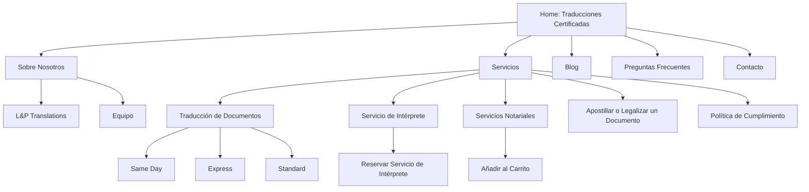

Below is a comprehensive report on the LP Translations website, including a mermaid diagram that visualizes its structure, as well as an in‐depth branding analysis.

---

# LP Translations Website Analysis Report

## 1. Website Structure

The site is organized in a clear hierarchical fashion, which helps users easily navigate through its key sections. The main components include:

- **Homepage ("Traducciones Certificadas")**  
  The landing page introduces the core promise and showcases testimonials, service highlights, and quick access to major offerings.

- **Sobre Nosotros (About Us)**  
  This section provides insight into the company’s background and team:  
  - *L&P Translations*  
  - *Equipo*  

- **Servicios (Services)**  
  A detailed breakdown of service offerings, with each category addressing specific translation needs:  
  - *Traducción de Documentos*  
    - *Same Day*  
    - *Express*  
    - *Standard*  
  - *Servicio de Intérprete*  
    - *Reservar Servicio de Intérprete*  
  - *Servicios Notariales*  
    - *Añadir al Carrito*  
  - *Apostillar o Legalizar un Documento*  
  - *Política de Cumplimiento*

- **Blog**  
  A resource center for updates and articles.

- **Preguntas Frecuentes (FAQ)**  
  Answers to common customer questions.

- **Contacto (Contact)**  
  Essential contact details including address, phone, email, and social media links.

Additionally, the homepage includes specialized sections such as customer testimonials, a comprehensive list of document categories (ranging from legal to medical), and service guarantees that emphasize quality and speed.

---

## 2. Mermaid Visualization of Site Structure

*This diagram encapsulates the main pages and subpages as presented in the site’s navigation and footer links* cite0†, cite2†.

---

## 3. Holistic Branding Analysis

### 3.1 Color Scheme & Visual Design

- **Clean & Professional:**  
  The website employs a modern, clean layout with a predominantly white background that enhances readability. Accent colors—likely blues or subtle contrasting hues—support a calm, trustworthy, and professional ambiance. This color choice is typical for service-based sites where clarity and professionalism are key cite0†.

### 3.2 Messaging & Tone

- **Core Message:**  
  The headline "Tu Voz En Cualquier Idioma" immediately positions LP Translations as a gateway to overcoming language barriers. The messaging is direct and reassuring, emphasizing quality and the ability to handle any document type with precision.
  
- **Trust & Reliability:**  
  The brand leverages customer testimonials and a strong reputation ("Excelentes reseñas", "más de 7 años de experiencia") to build trust. Phrases like "La Calidad es Nuestra Firma" and assurances regarding document acceptance (USCIS guarantee) underscore expertise and reliability cite5†, cite3†.

- **Customer-Centric:**  
  Clear calls-to-action (e.g., "Clic para Comenzar", "Reservar Servicio") and accessible contact options highlight a focus on prompt and supportive customer service.

### 3.3 Uniqueness & Value Proposition

- **Specialization in Certified Translations:**  
  The emphasis on “Traducciones Certificadas” sets the brand apart from generic translation services. This specialization is crucial for handling legal, medical, and official documents where accuracy is non-negotiable.

- **Comprehensive Service Offering:**  
  In addition to document translation, the inclusion of notarization, apostille services, and interpreter bookings positions LP Translations as a one-stop solution for various certification and language service needs.

- **Expertise & Experience:**  
  The site repeatedly references the company's extensive experience and the professional credentials of its team, which reinforces a high level of expertise and trustworthiness.

### 3.4 Overall User Experience

- **Intuitive Navigation:**  
  The clear, hierarchical structure of the website (as depicted above) ensures users can quickly locate the information they need.
  
- **Engaging Visual Elements:**  
  Use of images (e.g., flags representing multiple languages, team photographs, certification badges) and customer testimonials creates an engaging and reassuring environment for potential clients.
  
- **Multi-Channel Contact Options:**  
  Multiple contact points (phone, email, WhatsApp, and social media) are seamlessly integrated, underscoring the brand’s commitment to accessibility and support.

---

## 4. Conclusion

LP Translations successfully communicates a strong brand identity rooted in trust, expertise, and efficiency. With a well-structured site that guides users through its array of services and a design that balances professional aesthetics with user-friendly navigation, the brand stands out as a reliable leader in certified translation services. The combination of a customer-focused approach, clear messaging, and a comprehensive service offering makes LP Translations a compelling choice for those seeking high-quality translation and certification solutions.