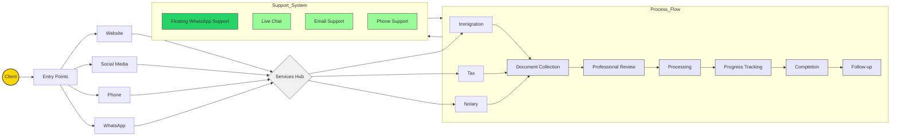
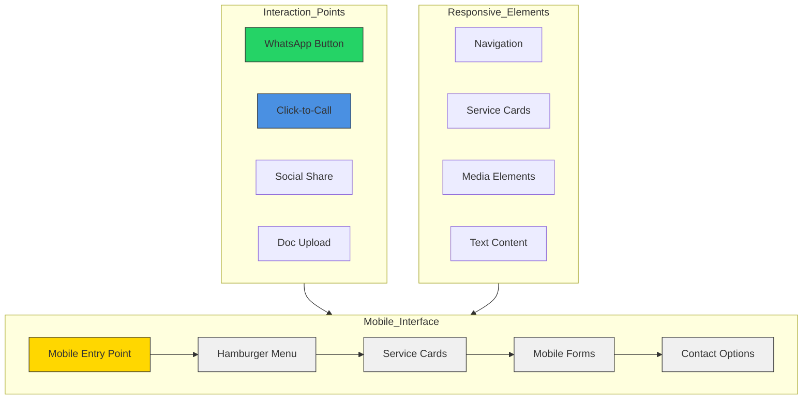

# PDM Immigration Services - Business Analysis Report

## 1. Executive Overview

PDM Immigration Services stands as a comprehensive immigration solutions provider, offering a unique blend of professional services tailored to support individuals throughout their immigration journey in the United States. Established as PDM Multiservices LLC in December 2023, the company has quickly positioned itself as a trusted partner in immigration services, tax preparation, and notary services.

---

## 2. Website Architecture & User Experience

### 2.1 Complete Site Structure

```mermaid
graph TD
    Home[Homepage]
    Nav[Navigation Bar]
    Services[Services Hub]
    About[About Us]
    Blog[Blog & Resources]
    Contact[Contact]
    Portal[Client Portal]
    Footer[Footer]

    subgraph Navigation
        Nav --> Home
        Nav --> Services
        Nav --> About
        Nav --> Blog
        Nav --> Contact
        Nav --> Portal
    end

    subgraph Main_Services
        Services --> Immigration[Immigration Services]
        Services --> Tax[Tax Services]
        Services --> Notary[Notary Services]
        
        Immigration --> AS[Asylum Services]
        Immigration --> WP[Work Permits]
        Immigration --> FP[Family Petitions]
        Immigration --> RS[Residency Services]
        Immigration --> CS[Citizenship]
        Immigration --> IC[Immigration Consulting]
        
        AS --> ASF[/Application Forms/]
        AS --> ASD[/Document Checklist/]
        AS --> ASP[/Process Timeline/]
        
        Tax --> TI[Individual Tax]
        Tax --> TC[Corporate Tax]
        Tax --> TP[Tax Planning]
        
        Notary --> NC[Certifications]
        Notary --> NA[Authentications]
        Notary --> NL[Legal Documents]
    end

    subgraph Interactive_Elements
        Float[Floating WhatsApp]
        Theme[Theme Toggle]
        Forms[Contact Forms]
        Schedule[Appointment System]
        Upload[Document Upload]
        Track[Progress Tracking]
    end

    subgraph Footer_Section
        Footer --> Social[Social Media Links]
        Footer --> Legal[Legal Information]
        Footer --> Hours[Business Hours]
        Footer --> Address[Location]
    end

    style Home fill:#FFD700,stroke:#333,stroke-width:2px
    style Nav fill:#f0f0f0,stroke:#333
    style Services fill:#f0f0f0,stroke:#333
    style Float fill:#25D366,stroke:#333
    style Theme fill:#1a1a1a,stroke:#333
    style Portal fill:#4A90E2,stroke:#333
    
    classDef form fill:#FFE4B5,stroke:#333
    classDef interactive fill:#98FB98,stroke:#333
    class ASF,ASD,ASP form
    class Float,Theme,Forms,Schedule,Upload,Track interactive
```

### 2.2 Service Integration Flow

### 2.3 User Interface Elements

#### Responsive Components
- Collapsible navigation menu for mobile
- Responsive grid layouts for service cards
- Adaptive content sections
- Touch-friendly interface elements

#### Interactive Features
- Floating WhatsApp button
  * Fixed position bottom-right corner
  * Pulse animation for attention
  * Direct link to business WhatsApp
- Dark/Light mode toggle
  * Smooth transition animations
  * Persistent user preference storage
  * Automatic system preference detection

#### Animation Elements
- Fade-in content on scroll
- Smooth page transitions
- Hover effects on service cards
- Loading state animations
- Progress indicators
- Micro-interactions feedback

---

## 3. Page-by-Page Analysis

### 3.1 Homepage
- Hero section with dynamic background
- Service highlights with animated cards
- Testimonial carousel
- Call-to-action buttons
- WhatsApp integration
- Language switcher (English/Spanish)

### 3.2 Services Pages

#### Immigration Services Portal
- Service category navigation
- Interactive process timelines
- Document requirement checklists
- Fee calculators
- Success stories
- FAQ accordions

#### Tax Services Hub
- Tax preparation checklist
- Document upload portal
- Tax calendar
- Estimation tools
- Business tax resources
- Annual filing guides

#### Notary Services Center
- Service scheduling system
- Required document lists
- Mobile notary information
- Pricing calculator
- Online appointment booking

### 3.3 Client Portal
- Secure login system
- Document storage
- Application status tracking
- Appointment management
- Message center
- Payment history
- Document requests

### 3.4 Blog & Resources
- Immigration news updates
- Tax filing tips
- Process guides
- Document templates
- Video tutorials
- Legal updates
- Success stories

### 3.5 Contact & Support
- Multi-channel contact options
- Interactive office map
- Business hours
- Emergency contact information
- Feedback forms
- Social media links

## 4. Core Service Analysis

### 3.1 Immigration Services Portfolio

#### Asylum Services
- Comprehensive assistance in political asylum processes
- Case preparation and documentation
- Representation before immigration authorities
- Strategic guidance throughout the asylum journey

#### Work Authorization
- Streamlined work permit application process
- Documentation management
- Status tracking and renewal assistance
- Compliance verification

#### Family Reunification
- Family petition processing
- Documentation preparation
- Application strategy development
- Progress monitoring and updates

#### Permanent Residency
- Green Card application assistance
- Interview preparation
- Documentation review
- Status adjustment guidance

#### Citizenship Services
- Naturalization application support
- Citizenship test preparation
- Document certification
- Interview coaching

### 3.2 Supplementary Services

#### Professional Tax Services
- Individual tax preparation
- Corporate tax filing
- Tax compliance consulting
- Maximum return optimization
- Year-round tax planning support

#### Notary Public Services
- Document certification
- Authentication services
- Immigration-related notarizations
- Legal document verification

---

## 4. Unique Value Propositions

### 4.1 Service Integration
- Seamless coordination between immigration and tax services
- One-stop solution for multiple documentation needs
- Integrated consultation approach
- Streamlined communication channels

### 4.2 Client-Centric Approach
- Direct phone consultation availability
- Multi-platform accessibility
- Bilingual support (English/Spanish)
- Personalized service strategies

### 4.3 Digital Innovation
- WhatsApp integration for instant communication
- Active social media presence (TikTok, Facebook)
- Modern, mobile-first website design
- Digital document management

---

## 5. Brand Identity Analysis

### 5.1 Visual Elements
- **Primary Colors**: Gold (#FFD700) and Black
  - Gold: Represents premium service quality and trust
  - Black: Conveys professionalism and sophistication

### 5.2 Communication Style
- Professional yet approachable tone
- Bilingual messaging
- Emphasis on trust and reliability
- Clear and direct service descriptions

### 5.3 Digital Presence
- Responsive website design
- Social media integration
- Interactive service modules
- Seamless mobile experience

---

## 6. User Experience & Journey Analysis

### 6.1 Client Journey Map

### 6.2 Mobile Experience Flow

---

## 7. Market Position & Growth Strategy

### 7.1 Geographic Focus
- Primary market: Miami-Dade County
- Strategic location in Surfside
- Accessible to South Florida immigration community

### 7.2 Digital Expansion
- Enhanced online presence
- Social media engagement
- Digital service delivery options
- Virtual consultation capabilities

### 7.3 Service Development
- Continuous service portfolio expansion
- Integration of new technologies
- Enhanced client support systems
- Community engagement initiatives

---

## 8. Future Outlook

PDM Immigration Services is positioned for sustainable growth through:
- Expanded service offerings
- Enhanced digital capabilities
- Strengthened community presence
- Continued excellence in client service

The combination of comprehensive immigration services, professional tax preparation, and notary services, delivered through a modern, client-centric approach, establishes PDM Immigration Services as a unique and valuable partner in the immigration services sector.

---

*This report was generated on February 12, 2025*
